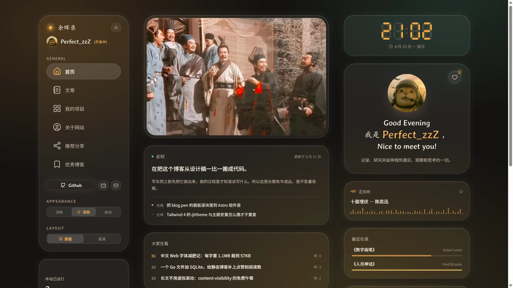

<div align="center">

# 余晖录 · AFTERGLOW NOTES

**像素级还原自己设计稿的个人博客** —— Astro 静态站 + Go 单二进制，也可以完全不要服务器

[](https://github.com/QssssY/AfterGlow-Notes/actions/workflows/deploy.yml)
[](LICENSE)
[](https://astro.build)
[](https://tailwindcss.com)
[](server/)

一个**个人学习项目**：从 Pencil 设计稿到前后端代码都是练手之作，边搭边学，不定期推翻重来。

⚡ [三分钟拥有自己的一份（零代码 · 零服务器 · 免费）](docs/easy-deploy.md) ·
🖥 [服务端部署手册](server/README.md)

</div>

## 界面预览

|                      首页 · 浅色                      |                     首页 · 深色                      |
| :---------------------------------------------------: | :--------------------------------------------------: |
|  |  |
|                      **文章页**                       |                     **我的项目**                     |
|             |     |

> 统一 1600 × 900 视口截取。明暗主题与双布局都能在侧栏一键切换，换页零白屏。

## 特性

**读者看到的**：像素级还原设计稿的界面 · 明暗主题（圆形揭示切换）· 瞬时换页 + 卡片错峰入场 ·
双布局模式（原版 / 紧凑）· Pagefind 全文搜索 · 跨页不断的音乐播放器（歌词跟随 · 顺序 / 随机 / 单曲循环）·
RSS / Sitemap / 每页自动生成 OG 图 · 中文字体子集化（每字重 1.1MB → 约 170KB）

**站长用到的**：网页管理台 `/overview`（写文章、改站点数据、传图、配色、统计曲线、友链巡检），
**双后端**——有服务器走 Go 服务，纯静态托管自动切 **GitHub 直连模式**（细粒度令牌登录，
保存即提交、平台自动重建）· 点赞 / 阅读 / 在线人数（匿名聚合，不存 IP / UA）·
所有内容改动落成仓库文件，**git 是唯一事实源**

## 部署：按你手上有什么选

| | 需要什么 | 得到什么 |
|---|---|---|
| **方式 C · 零服务器** | 一个 GitHub 账号 | 完整博客 + 管理台（GitHub 直连）；点赞仅存访客本机，阅读数 / 在线不渲染 |
| **方式 A · 前端平台 + API 小机子** | 低配 VPS + 域名 | 全部功能；页面走平台 CDN，服务器只出 JSON 和音乐 |
| **方式 B · 单机整站** | 低配 VPS（可无域名） | 全部功能；一个进程托管一切，纯 IP 也能跑 |

### 方式 C：零服务器，一键免费托管

[](https://vercel.com/new/clone?repository-url=https%3A%2F%2Fgithub.com%2FQssssY%2FAfterGlow-Notes)

什么环境变量都不用配，构建出来就是纯静态形态。管理台照样有：`/overview` 走
GitHub 直连模式 —— 粘贴一个细粒度令牌，写文章 / 改数据 / 传图 / 调配色都在网页里，
保存 = git 提交 = 平台自动重建（思路致敬 [YYsuni 的 /write](https://github.com/YYsuni/2025-blog-public)）。

📖 **从注册到发出第一篇文章的保姆级教程（Vercel / CF Pages / GitHub Pages 三选一，
附四段复制即用的 AI 指令）：[docs/easy-deploy.md](docs/easy-deploy.md)**

### 方式 A：前端交给平台，API 放小机子

前端连到任意平台（构建命令 `pnpm build`、输出 `dist`、Node 22），环境变量设
`PUBLIC_API_BASE=https://api.你的域名`；小机子上 systemd 常驻 Go 服务 + Caddy 反代。
完整步骤（交叉编译、service 文件、Caddyfile、`-origin` 跨域）见
[`server/README.md`](server/README.md)。

### 方式 B：一台小机子整站自托管

构建用 `PUBLIC_API_BASE=same-origin`，服务启动加 `-site dist` —— 静态文本预压
brotli（约 1/7）+ 哈希资源缓存一年，低配小机子跑全站绰绰有余；没有域名就 `-addr :80`
纯 IP 直跑。仓库自带两个脚本（连接信息走环境变量，不进仓库）：

```bash
AFTERGLOW_HOST=root@服务器IP bash scripts/deploy-setup.sh   # 首次：编译上传 + 管理口令 + systemd
AFTERGLOW_HOST=root@服务器IP bash scripts/deploy.sh         # 日常：构建 → 增量同步 → 原子换 dist → 体检
```

本仓库自己的发布走 CI：push → GitHub Actions 构建发 Release → 服务器定时自取
（[.github/workflows/deploy.yml](.github/workflows/deploy.yml) 顶部有这么设计的原因）。

## 本地跑起来

前置：Node ≥ 22.12、pnpm；想要动态数据 / 管理台再装 Go ≥ 1.27。

```bash
pnpm install
pnpm dev                  # http://localhost:4321（自动先跑中文字体子集化）
```

可选：拉起 Go 服务（`.env` 把 `PUBLIC_API_BASE` 指向它，点赞 / 阅读 / 管理台即刻可用）：

```bash
cd server
go build -o afterglow-server.exe .
ADMIN_PASSWORD="$(openssl rand -base64 18)" ./afterglow-server.exe -blog-dir ..
```

预演生产形态（Go 托管全站、同源 API）：`PUBLIC_API_BASE=same-origin pnpm build`，
然后 `cd server && ./afterglow-server.exe -site ../dist`，浏览器开 `http://127.0.0.1:8787`。

## 配置参考

| 名字 | 给谁 | 说明 |
|---|---|---|
| `PUBLIC_API_BASE` | 前端构建 | Go 服务地址；`same-origin` = 同源（方式 B；Windows Git Bash 别写 `/`，会被 MSYS 路径转换偷换）；**不设 = 纯静态形态，管理台自动切 GitHub 直连** |
| `PUBLIC_SITE_URL` | 前端构建 | 站点正式地址（RSS / Sitemap / OG 绝对链接），一键托管平台在环境变量里给 |
| `PUBLIC_MUSIC_BASE` | 前端构建 | 音乐来源前缀；分体部署设 `https://api.你的域名`（音乐不进仓库） |
| `ADMIN_PASSWORD` / `-admin-pass` | Go 服务 | 管理台口令；不设则管理接口整组关闭；弱口令直接拒绝启动 |
| `-site` / `-music` / `-blog-dir` | Go 服务 | 静态站目录（设了就整站托管）/ 音乐目录 / 仓库根目录 |
| `-origin` | Go 服务 | CORS 允许来源（方式 A 写站点完整地址）；`-db` `-addr` `-max-writes` 见 `-h` |
| `GITHUB_TOKEN` | Go 服务 | 可选：GitHub 代理配额 60 → 5000 次/时 |

上线前过一眼：站点地址（`PUBLIC_SITE_URL` 或 `astro.config.mjs` 的 `site`）、
管理口令换随机串、方式 A 的 `-origin`。

## 变成你自己的博客

fork 下来的是「我的余晖录」，这些地方换成你的（大部分在管理台 `/overview` 里点点就行，
改动全部落成仓库文件）：

- **站点信息**：站名 / 作者 / 邮箱 / 简介 / 细则 → 管理台「站点数据 · 站点信息」（`src/data/site.json`）
- **文章**：清掉 `src/content/posts/*.md` 换成你的。front-matter 字段：
  `title` / `description` / `date` / `updated` / `tags` / `category` / `cover`（封面放 `_covers/`）/ `draft`
- **活数据**：在读 / 此刻 / 在用 / 更新日志 / 友链 / 项目 / 推荐分享 → 管理台各页签（`src/data/*.json`）
- **图片**：头像、友链头像、项目配图都从管理台上传（自动归位到 `images/` 对应目录）
- **音乐**：版权物不进仓库（`public/music/` 已 gitignore）。本地丢进 `public/music/` 即可预览；
  有服务器时放 `-music` 目录并设 `PUBLIC_MUSIC_BASE`。**请只使用你有权使用的曲目**
- **设计**：`blog.pen` 是 Pencil 设计源文件；设计 token（颜色 / 圆角 / 玻璃卡）都在
  `src/styles/global.css` 的 `:root` / `.dark` 里，改这里全站生效
- **结构常量**：导航、建站起始日等在 `src/config.ts`

## 技术栈与目录

| 层 | 技术 |
|---|---|
| 前端 | Astro 7（SSG + View Transitions）· Tailwind CSS 4 · TypeScript |
| 内容 | Markdown（Content Collections）+ `src/data/*.json`，git 即事实源 |
| 动态数据 | Go + SQLite（modernc 纯 Go 免 CGO）：点赞、阅读、在线、GitHub 代理、静态托管、管理后台 |
| 搜索 / 图 | Pagefind 全文搜索 · satori + resvg 构建期 OG 图 · sharp 图片处理 |

```
src/content/posts/   文章（front-matter + Markdown），_covers/ 放封面
src/data/            站点数据 JSON（管理台的写入目标）
src/components/      按页面分组的 Astro 组件
src/styles/          global.css（设计 token 在此）+ admin.css
src/scripts/         浏览器端：api / admin / gh-cms（GitHub 直连）等
server/              Go 服务：main / static / visitors / linkcheck / admin / github
scripts/             字体子集化、仓库数据同步、部署脚本
blog.pen             Pencil 设计源文件
```

## 致谢

界面与工程上大量借鉴了两个优秀的开源博客，特此感谢：

- **[CuteLeaf / Firefly](https://github.com/CuteLeaf/Firefly)** —— 界面雏形与 Astro 静态站基础设施（Markdown 插件链、Pagefind 搜索、OG 图、字体子集化等思路均参考自它）
- **[YYsuni / 2025-blog-public](https://github.com/YYsuni/2025-blog-public)** —— 紧凑布局模式、粘性策略、七段数码管大时钟、GitHub 直连写作后台的思路

站里学来的每一处，代码注释里都注明了出处。

## 许可

代码以 [MIT](LICENSE) 许可开源；文章与图片内容采用
[CC BY-NC 4.0](https://creativecommons.org/licenses/by-nc/4.0/deed.zh) 授权（转载注明出处、不得商用）。
仓库不含任何音乐文件（版权物不随代码分发，git 历史亦已清理），
**请只在自己的部署里使用有权使用的曲目**。
